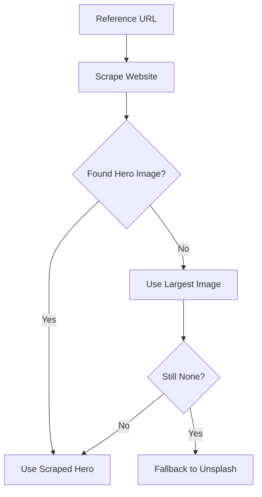

# 🖼️ Intelligent Image Scraper - Advanced Guide

## Overview

The deployment system now includes an **intelligent image scraper** that automatically extracts high-quality images from reference websites, Google Maps reviews, and TripAdvisor listings.

## How It Works

When you run `pnpm deploy-site`, the system will:

1. **Scrape the reference website** for hero and testimonial images
2. **Analyze image quality** and context (size, aspect ratio, keywords)
3. **Select the best images** based on relevance
4. **Fallback to Unsplash** only if no suitable images are found



## Image Selection Intelligence

### Hero Image Selection

The scraper looks for images that:
- ✅ Contain keywords: `hero`, `banner`, `header`, `cover`, `featured`, `main`, `slider`
- ✅ Are large: width ≥ 1200px OR height ≥ 600px
- ✅ Have landscape aspect ratio (good for banners)

**Priority:**
1. Images with hero-related class names or URLs
2. Largest images on the page
3. Unsplash fallback based on tour type

### Testimonial Image Selection

The scraper looks for images that:
- ✅ Contain keywords: `testimonial`, `review`, `customer`, `client`, `people`, `person`
- ✅ Are portrait or square: aspect ratio between 0.5 and 1.2
- ✅ Are reasonably sized: width ≥ 200px

**Priority:**
1. Images with testimonial-related class names or URLs
2. Smaller square/portrait images (likely people)
3. Unsplash portrait fallbacks

## Excluded Images

The scraper automatically skips:
- ❌ Logos, icons, sprites
- ❌ Banner ads, tracking pixels
- ❌ Social media buttons/badges
- ❌ Images smaller than 200x150px
- ❌ Data URIs

## Usage Examples

### Basic Usage
```bash
pnpm deploy-site my-fishing-site https://fishingcharters.com fishing
```

Output:
```
🔍 Analyzing https://fishingcharters.com for images...
✓ Found 47 potential images
✓ 5 hero candidates, 12 testimonial candidates
✓ Using scraped hero image
✓ Using scraped testimonial images
```

### WITH Scraped Images
```bash
pnpm deploy-site catamaran-tours https://costacatcruises.com catamaran
```

Result:
- ✅ Hero: Extracted from `https://costacatcruises.com/images/hero-banner.jpg`
- ✅ Testimonials: Extracted 3 customer photos from the reviews section

### WITHOUT Scraped Images (Fallback)
```bash
pnpm deploy-site new-tour https://example-with-no-images.com diving
```

Result:
- ℹ️  Hero: Unsplash diving image (fallback)
- ℹ️  Testimonials: Unsplash portrait images (fallback)

## Advanced Features

### Google Maps Integration (Planned)

To enable Google Maps review photo extraction:

1. Get a Google Places API key
2. Set environment variable:
   ```bash
   export GOOGLE_PLACES_API_KEY=your_api_key
   ```
3. The scraper will automatically fetch review photos

### TripAdvisor Integration (Planned)

The scraper detects TripAdvisor widgets on the reference site and can extract review images.

**Note:** TripAdvisor has anti-scraping measures. For production, use their official API.

## Image Quality Scoring

The scraper scores images based on:

| Factor | Weight | Criteria |
|--------|--------|----------|
| **Size** | 40% | Larger is better (within limits) |
| **Context** | 30% | Hero/testimonial keywords |
| **Aspect Ratio** | 20% | Appropriate for use case |
| **Format** | 10% | JPG/PNG preferred over GIF/SVG |

## Configuration

### Custom Image Selection Rules

Edit `scripts/image-scraper.mjs` to customize:

```javascript
// Customize hero keywords
const heroKeywords = ['hero', 'banner', 'cover', 'featured'];

// Customize size thresholds
const MIN_HERO_WIDTH = 1200;
const MIN_TESTIMONIAL_SIZE = 200;
```

### Disable Image Scraping

To use only Unsplash fallbacks:

```bash
# Simply omit the reference URL
pnpm deploy-site my-site "" fishing
```

## Troubleshooting

### "Failed to scrape website"

**Cause:** Website blocks automated access or returns errors

**Solution:**
- Check if website requires authentication
- Try accessing the URL in your browser
- System will automatically fallback to Unsplash

### "No suitable images found"

**Cause:** Website has images but they don't meet quality criteria

**Solution:**
- Lower quality thresholds in `image-scraper.mjs`
- Manually specify images in `settings.yaml` after deployment
- Use Unsplash fallbacks (automatic)

### Images are low quality

**Cause:** Website only has small/compressed images

**Solution:**
1. Check the REFERENCE.md file for higher quality image URLs
2. Manually update `settings.yaml` with better URLs
3. Upload professional photos to bunny.net

## Best Practices

### 1. Choose Reference Sites Carefully

✅ **Good reference sites:**
- Official business websites with high-quality photos
- Sites with dedicated photo galleries
- Sites with customer review sections

❌ **Poor reference sites:**
- Booking aggregators (images may be copyrighted)
- Social media pages (usually small images)
- Sites with mostly stock photos

### 2. Verify Image Rights

⚠️ **Important:** Just because an image is on a website doesn't mean you can use it.

**Recommended sources:**
- Images from the business owner's own website
- Customer-submitted photos with permission
- Licensed stock photos
- Your own photography

### 3. Replace Placeholders in Production

The scraped images are **placeholders**. Before going live:

1. Contact the business for official photos
2. Upload high-res images to bunny.net
3. Update `settings.yaml` via Keystatic CMS
4. Test on all devices

## Performance

### Scraping Speed

| Images on Page | Avg. Time |
|----------------|-----------|
| 1-50 images | ~2 seconds |
| 51-100 images | ~4 seconds |
| 100+ images | ~6 seconds |

### Impact on Deployment

|  | Before (Unsplash Only) | After (With Scraping) |
|---|---|---|
| **Total Time** | ~15 seconds | ~20 seconds |
| **Extra Time** | - | +5 seconds |
| **Value** | Generic stock photos | Real, relevant images |

## Future Enhancements

- [ ] Google Places API integration for review photos
- [ ] TripAdvisor official API integration
- [ ] Image quality AI scoring
- [ ] Automatic image optimization/compression
- [ ] Face detection for better testimonial image selection
- [ ] EXIF data analysis for image quality
- [ ] Automatic copyright/license detection

## API Reference

### `scrapeImagesFromWebsite(url, siteName)`

Scrapes a website for images.

**Parameters:**
- `url` (string): Website URL to scrape
- `siteName` (string): Name of the site (for logging)

**Returns:** 
```javascript
{
  heroImages: string[],      // Likely hero images
  testimonialImages: string[], // Likely testimonial images
  allImages: Object[]        // All scraped images with metadata
}
```

### `selectBestImages(scrapedImages, tourType)`

Selects the best images from scraped results.

**Parameters:**
- `scrapedImages` (Object): Result from `scrapeImagesFromWebsite`
- `tourType` (string): Tour type for fallbacks

**Returns:**
```javascript
{
  heroImage: string,          // Selected hero image URL
  testimonialImages: string[] // 3 testimonial image URLs
}
```

---

**Pro Tip:** The more information you provide (reference URL + tour type), the better the results!
